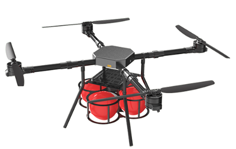
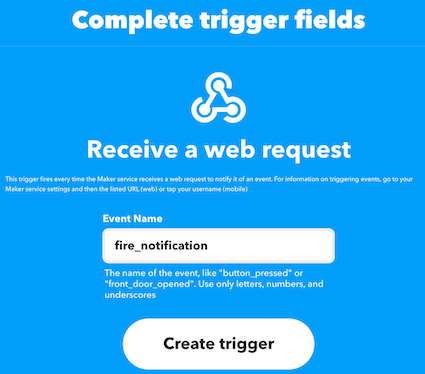
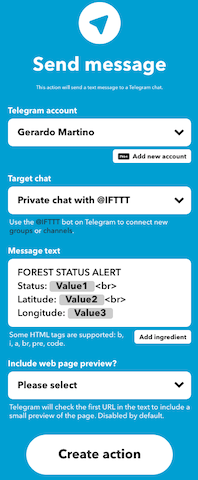

# Cyber-Physical-System-for-Wildfire-Detection-and-Firefighting

Link for the article belongs to the Special Issue Key Intelligent Technologies for Wireless Communications and Internet of Things): https://www.mdpi.com/2376582

<p align="center">

</p>

## Summary

[1. Introduction](#Introduction): Problem introduction and a possible solution\
[2. Architecture](#Architecture): Architecture of the idea\
[3. Project structure](#Project-structure): How the project is organized\
[4. Getting started](#Getting-started): Guide to run the project

## Introduction

This is a project for the master degree in **Computer Science with specialization in Internet of Things**.<br>

This project aims to design a cyber-physical system for early detection and rapid response to forest fires using advanced technologies. The system incorporates Internet of Things sensors, autonomous unmanned aerial and ground vehicles controlled by the robot operating system.

## Architecture


This architecture diagram represents a sophisticated system designed for wildfire detection and management using a combination of IoT (Internet of Things), unmanned aerial vehicles (UAVs), unmanned ground vehicles (UGVs), middleware, and notification systems. Let's break down each component and their interactions:

### 1. **Wildfire Detection System**
- **MQTT:** This section depicts an IoT-based system where sensors deployed in a forest environment detect potential fire incidents. MQTT (Message Queuing Telemetry Transport) is used as the communication protocol, ideal for low-bandwidth, high-latency environments typical in remote forest areas. MQTT topics like `/forest/iot/sensor` and `/forest/iot/fire` are likely used for transmitting sensor data and fire alerts, respectively.

### 2. **Unmanned Vehicles**
- **Unmanned Aerial Vehicle (UAV):** Equipped with ROS (Robot Operating System) and MAVROS, a ROS package that provides MAVLink protocol support. This drone can autonomously navigate and send real-time data about its status (`/drone/status`) and fire detection alerts (`/drone/alert`) back to the middleware.
- **Unmanned Ground Vehicle (UGV):** Also integrated with ROS, allowing for interoperability with the UAV and robust ground-level operations. It likely handles tasks like physical inspection and possibly firefighting, sending its status (`/rover/status`) and alerts (`/rover/alert`) to the middleware.

### 3. **Middleware**
- **Node-RED + ROS:** Acts as the central hub for data aggregation and processing. Node-RED is a programming tool for wiring together hardware devices, APIs, and online services in new and interesting ways. It integrates seamlessly with ROS to process and respond to messages from both the UAV and UGV, as well as from the IoT sensors.

### 4. **Notification System**
- **Nuclio + IFTTT + Telegram Bot:** This setup is designed for alert dissemination. Nuclio is a high-performance serverless framework that processes the data streams efficiently. It likely triggers IFTTT (If This Then That) services to send notifications through various channels, one of which is a Telegram bot. This bot could alert emergency services, volunteers, or residents in the affected areas.

### 5. **Ground Control Station**
- Depicts a user interface where all data is visualized and monitored. This station is crucial for human operators to oversee operations, make decisions based on real-time data, and possibly manually control the UAV and UGV if needed.

This architecture leverages modern technologies to create a responsive and effective system for wildfire detection and response. The use of MQTT for sensor data, ROS for vehicle control, and a combination of Node-RED, Nuclio, and IFTTT for data processing and alerting makes this a highly scalable and versatile solution.

For further understanding and implementation, you may want to explore the following resources:
- [MQTT Protocol](https://mqtt.org/)
- [ROS Tutorials](http://wiki.ros.org/ROS/Tutorials)
- [MAVROS GitHub Repository](https://github.com/mavlink/mavros)
- [Node-RED Official Website](https://nodered.org/)
- [Nuclio Serverless Project](https://nuclio.io/)
- [IFTTT for Automation](https://ifttt.com/)
- [Creating Telegram Bots](https://core.telegram.org/bots)

These resources can provide in-depth guidance on configuring each component to suit specific needs, potentially enhancing your system's capabilities.

## Project Structure

### 1. Function

- **foresthandler.js**: Nuclio function that is executed when a fire is detected;
- **dronehandler.js**: Nuclio function that is executed when the drone released the fire ball extinguisher;
- **sendfirealarm.js**: Nuclio function to simulare a fire alarm;
- **.yaml**: function exported from Nuclio framework with all the deploying informations.

### 2. Sensor

- **IoTForestSensor.ino**: Sketch for the ESP32 MCU, used as flame detector.

### 3. Node-RED

- **flow.json**: Node-RED exported flow, in detail:
  - Forest IoT Sensors: flow used for the simulation of the different sensors usefull for fire detection;
  - Forest Dashboard: flow used to visualize the data stream from the forest sensors (with optional button for sensor simulation);
  - Drone Dashboard: flow used to visualize the status and the paramenter of the UAV.

### 4. Drone

- **mqtt_drone.py**: file containing all the function used by the drone to pub/sub and run specific corridor mission;
- **mqtt_config.json**: contains the parameters to configure the drone as mqtt client.

## Getting Started

### Important Notes

Install Node.js using the installer [Download](https://nodejs.org/en/download/)
Install Docker following Docker installation guide [Get Docker](https://docs.docker.com/get-docker/).

- In order to execute the drone python script you need Python 3.7+: run python --version or python3 --version in a terminal to check the installed version
- If not installed use the following link: [Python](https://www.python.org/).
- Install pip3 package manager or run pip3 instead of pip and python3 instead of python, depending of your system defaults
- Install: [git](https://git-scm.com/downloads), [MAVSDK](https://github.com/mavlink/MAVSDK-Python), [aioconsole](https://aioconsole.readthedocs.io/en/latest/) and [aysncio-mqtt](https://github.com/sbtinstruments/asyncio-mqtt)

### IFTTT

Register on [IFTTT](https://ifttt.com) and [create a new applet](https://ifttt.com/create) by adding on IF clause `WebHooks service` > `Receive a web request` with the following parameter:



and with a `THEN clause Telegram > Send Message` with the following parameters:



Once done, by going into `My Applets` > `Fire Notification Applets` > `WebHook` > `Documentation` and copy the **_ifttt_event_key_**. That key need to be saved and used in the [Nuclio Forest function](Function/foresthandler.js) and [Nuclio Drone function](Function/dronehandler.js)

### Nuclio

Start [Nuclio](https://github.com/nuclio/nuclio) using a docker container.

```sh
$ docker run -p 8070:8070 -v /var/run/docker.sock:/var/run/docker.sock -v /tmp:/tmp nuclio/dashboard:stable-amd64
```

**Update and deploy Functions**:

- Browse to http://localhost:8070 to open the homepage of Nuclio;
- Create new project and call it **Forest Fire Detection**;
- Press `Create function`, `Import` and upload the **.yaml** function that are in the `Function` folder;
- Change the **_ip, port, username and password_** according with your MQTT broker also update the **_ifttt_event_key_** generated from IFTTT;
- On `Trigger` tab also change the **_ip, port, username and password_** according with your MQTT Broker;
- Press `Deploy`.

### RabbitMQ

Start [RabbitMQ](https://www.rabbitmq.com) instance with MQTT enabled using docker.

```sh
$ docker run -p 9000:15672  -p 1883:1883 -p 5672:5672  cyrilix/rabbitmq-mqtt
```

Browse to http://localhost:9000. The default username is **_guest_**, and the password is **_guest_**

### PX4 SITL (Software In The Loop)

Start [PX4 SITL](https://github.com/JonasVautherin/px4-gazebo-headless) instance using docker.

```sh
$ docker run --rm -it jonasvautherin/px4-gazebo-headless:1.13.0
```

### MAVSDK Python

Is a Python wrapper for MAVSDK. MAVSDK is a set of libraries providing a high-level API to MAVLink, it allow to write programs and to control a MAVLink-enabled drone.

#### Parameters

In order to execute Python script ([mqtt_drone.py](Drone/mqtt_drone.py)) you need to set the following parameters on ([mqtt_config.json](Drone/mqtt_config.json)):

- **_ip_**: address of the broker;
- **_port_**: port of the broker;
- **_username_**: user used for the authentication;
- **_password_**: psw used for the authentication.

Once done execute the script:

```sh
$ python3 mqtt_drone.py
```

### Node-RED

Start [Node-RED](https://nodered.org/docs/getting-started/docker) instance using docker.

```sh
$ docker run -it -p 1880:1880 -v node_red_data:/data --name mynodered nodered/node-red
```

**Installation and Configuration**:

- Browse to http://localhost:1880 to open the homepage of Node-RED;
- '**Import**' the ([flow.json])(Node-RED/flow.json);
- Press `Manage palette` and from `Install` tab, search for the following palette:
  - node-red-dashboard;
  - node-red-contrib-web-worldmap;
  - node-red-contrib-ui-led;
  - node-red-contrib-mqtt-broker;
- Press on one of the **mqtt nodes**, edit **mqtt-broker node** and change according with your MQTT Broker, **_Server_** and **\_Port** in `Connection` and **_User_** and **_Password_** in `Security`;

### Forest IoT Sensor


Connect all the components according with [ESP32_Connections.fzz])(IoTForestSensor/ESP32_Connections.fzz);

**Installation and Configuration**:

- Start `Arduino IDE` and `Open` [IoTForestSensor.ino])(IoT_Forest_Sensor/IoTForestSensor.ino);
- Configure **_mqtt_server_** and **_mqtt_port_** according with your MQTT Broker and set **_ssid_** and **_password_**;
- Press and select the right board: `Tools` > `Board` > `ESP32 Arduino` > `DOIT ESP32 DEVKIT V1`
- Uodate the `Upload Speed` to 115200 and `Port` with the correct one;
- `Verify` and `Upload` the Sketch on the ESP32 MCU board.
- Open the `Serial monitor` and check if connected.