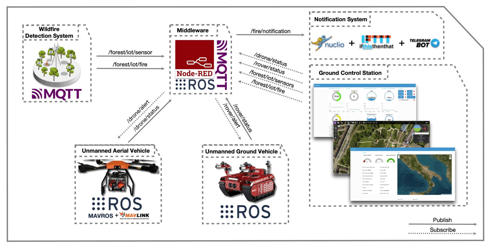
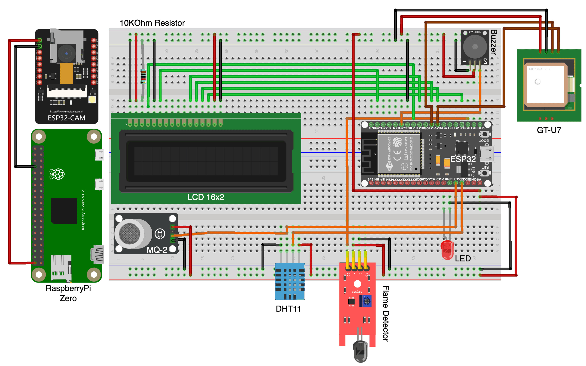
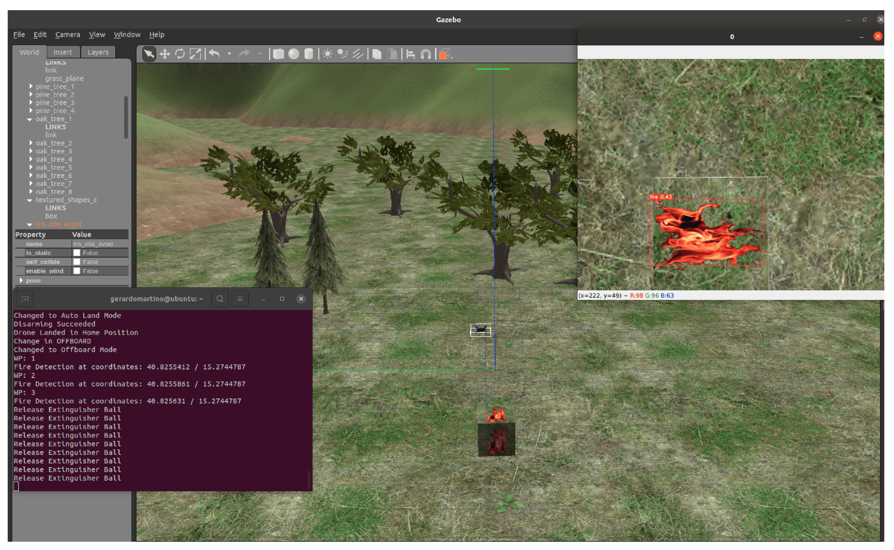

# Cyber-Physical-System-for-Wildfire-Detection-and-Firefighting

Link for the article belongs to the Special Issue Key Intelligent Technologies for Wireless Communications and Internet of Things): https://www.mdpi.com/2376582

## Summary

[1. Introduction](#Introduction): Problem introduction and a possible solution\
[2. Architecture](#Architecture): Architecture of the idea\
[3. Project structure](#Project-structure): How the project is organized\
[4. Getting started](#Getting-started): Guide to run the project

## Introduction

This is a project for the master degree in **Computer Science with specialization in Internet of Things**. 

This project aims to design a cyber-physical system for early detection and rapid response to forest fires using advanced technologies. The system incorporates Internet of Things sensors, autonomous unmanned aerial and ground vehicles controlled by the robot operating system.

## Architecture

This architecture diagram represents a sophisticated system designed for wildfire detection and management using a combination of IoT (Internet of Things), unmanned aerial vehicles (UAVs), unmanned ground vehicles (UGVs), middleware, and notification systems. Let's break down each component and their interactions:

### 1. **Wildfire Detection System**
- **MQTT:** This section depicts an IoT-based system where sensors deployed in a forest environment detect potential fire incidents. MQTT (Message Queuing Telemetry Transport) is used as the communication protocol, ideal for low-bandwidth, high-latency environments typical in remote forest areas. MQTT topics like `/forest/iot/sensor` and `/forest/iot/fire` are likely used for transmitting sensor data and fire alerts, respectively.

### 2. **Unmanned Vehicles**
- **Unmanned Aerial Vehicle (UAV):** Equipped with ROS (Robot Operating System) and MAVROS, a ROS package that provides MAVLink protocol support. This drone can autonomously navigate and send real-time data about its status (`/drone/status`) and fire detection alerts (`/drone/alert`) back to the middleware.

The UAV node is a simulation environment in the Gazebo simulator, showing a scene with various tree models where a drone is used to detect and react to wildfires. The interface shows a fire being identified at specific coordinates (latitude and longitude), marked with a red bounding box around the flame image. The terminal logs reflect the drone's mode changes and fire detection, followed by commands to release extinguishing agents. This setup is likely part of a testing phase for an unmanned aerial system that uses image recognition and GPS data to locate and respond to fires, simulating real-world operations for a wildfire detection and management system.

- **Unmanned Ground Vehicle (UGV):** Also integrated with ROS, allowing for interoperability with the UAV and robust ground-level operations. It likely handles tasks like physical inspection and possibly firefighting, sending its status (`/rover/status`) and alerts (`/rover/alert`) to the middleware.

### 3. **Middleware**
- **Node-RED + ROS:** Acts as the central hub for data aggregation and processing. Node-RED is a programming tool for wiring together hardware devices, APIs, and online services in new and interesting ways. It integrates seamlessly with ROS to process and respond to messages from both the UAV and UGV, as well as from the IoT sensors.

### 4. **Notification System**
- **Nuclio + IFTTT + Telegram Bot:** This setup is designed for alert dissemination. Nuclio is a high-performance serverless framework that processes the data streams efficiently. It likely triggers IFTTT (If This Then That) services to send notifications through various channels, one of which is a Telegram bot. This bot could alert emergency services, volunteers, or residents in the affected areas.

### 5. **Ground Control Station**
- Depicts a user interface where all data is visualized and monitored. This station is crucial for human operators to oversee operations, make decisions based on real-time data, and possibly manually control the UAV and UGV if needed.

This architecture leverages modern technologies to create a responsive and effective system for wildfire detection and response. The use of MQTT for sensor data, ROS for vehicle control, and a combination of Node-RED, Nuclio, and IFTTT for data processing and alerting makes this a highly scalable and versatile solution.

For further understanding and implementation, you may want to explore the following resources:
- [MQTT Protocol](https://mqtt.org/)
- [ROS Tutorials](http://wiki.ros.org/ROS/Tutorials)
- [MAVROS GitHub Repository](https://github.com/mavlink/mavros)
- [Node-RED Official Website](https://nodered.org/)
- [Nuclio Serverless Project](https://nuclio.io/)
- [IFTTT for Automation](https://ifttt.com/)
- [Creating Telegram Bots](https://core.telegram.org/bots)

These resources can provide in-depth guidance on configuring each component to suit specific needs, potentially enhancing your system's capabilities.
